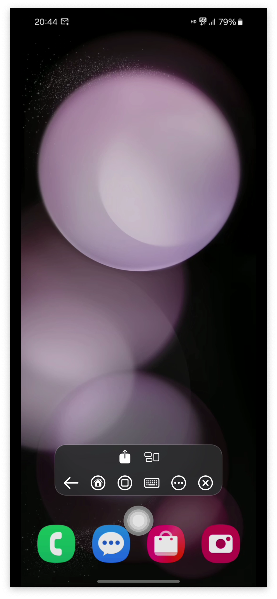
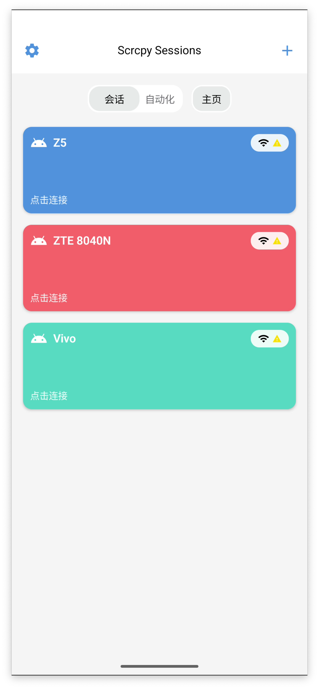
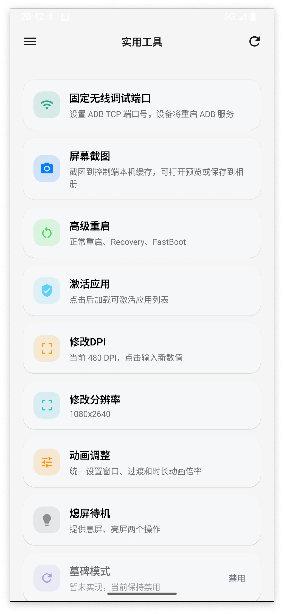
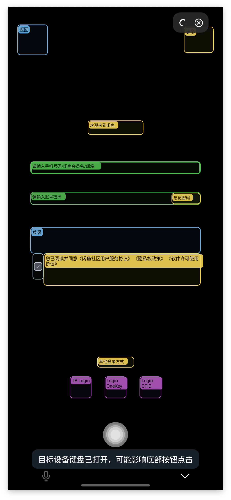

# Screen Remote

Screen Remote 是一个运行在 Android 设备上的远程控制应用。

它基于 scrcpy 协议链路，把设备连接、会话配置、屏幕镜像、控制输入，以及一组常用调试工具整理进同一个
Android 客户端里，适合做日常远控、联调和问题排查。

> [!IMPORTANT]
> [用户使用文档](https://github.com/XRSec/Screen-Remote/wiki/用户使用文档)  |  [开发文档](https://github.com/XRSec/Screen-Remote/wiki/开发文档)

## 可以做什么

- 管理多台设备和多组会话配置
- 通过 ADB、USB Host、Wireless Debugging 建立连接
- 查看远端画面，并发送触摸、按键和输入操作
- 查看设备信息、执行 Shell、管理应用和文件
- 使用布局检查等辅助能力做调试

## 界面预览

以下截图来自当前版本的 Android 客户端。

<table>
  <tr>
    <td align="center"></td>
    <td align="center"></td>
    <td align="center"></td>
  </tr>
  <tr>
    <td align="center"></td>
    <td align="center"></td>
    <td align="center"></td>
  </tr>
  <tr>
    <td align="center"></td>
    <td align="center"></td>
    <td align="center"></td>
    <td></td>
  </tr>
</table>

## Star History

<a href="https://www.star-history.com/?repos=XRSec%2Fscrcpy-mobile&type=date&legend=top-left">
 <picture>
   <source media="(prefers-color-scheme: dark)" srcset="https://api.star-history.com/chart?repos=XRSec/scrcpy-mobile&type=date&theme=dark&legend=top-left" />
   <source media="(prefers-color-scheme: light)" srcset="https://api.star-history.com/chart?repos=XRSec/scrcpy-mobile&type=date&legend=top-left" />
   
 </picture>
</a>
