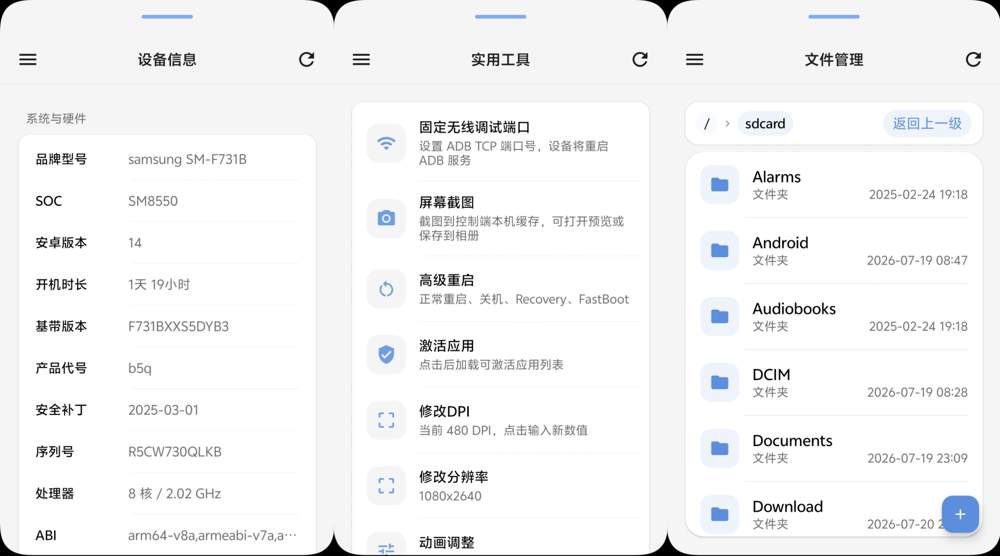
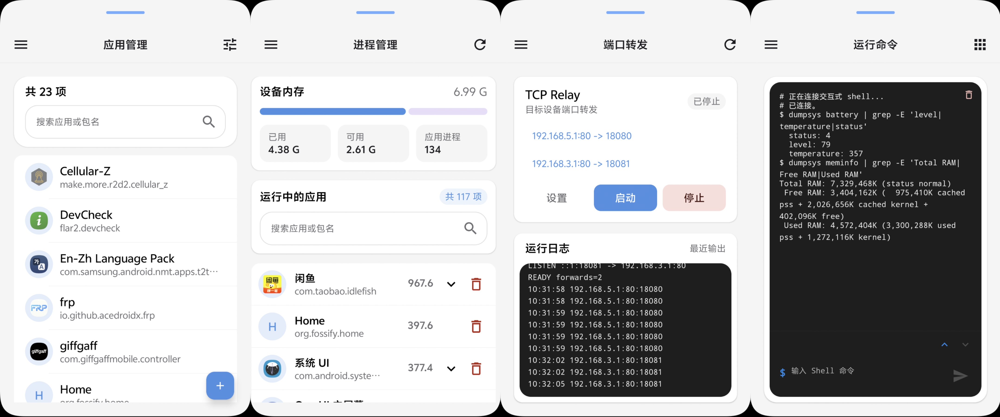
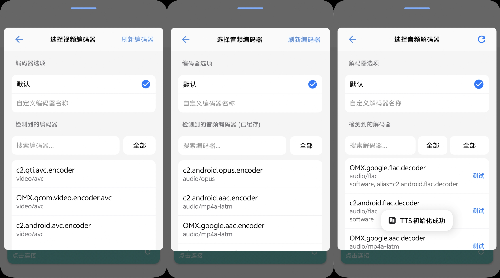
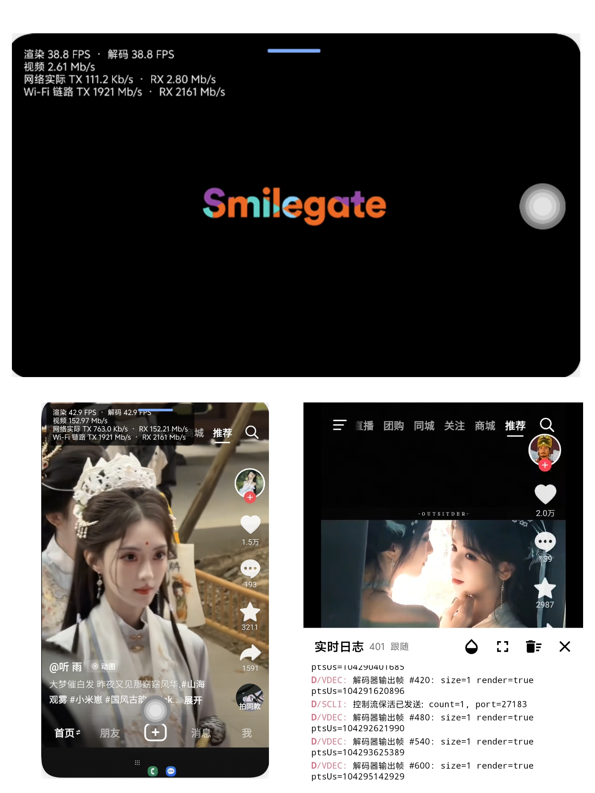
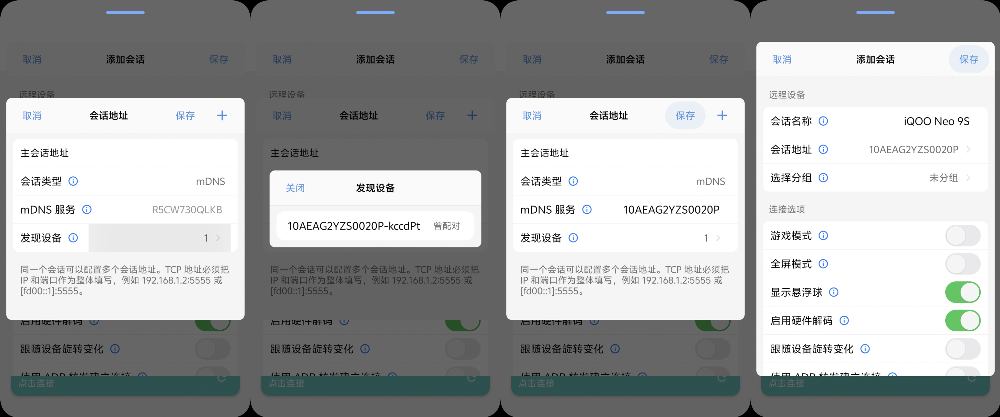
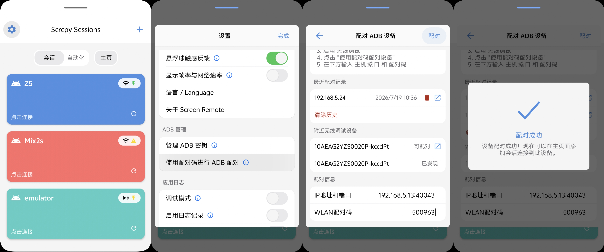

# Screen Remote

> [!IMPORTANT]
> [English](README.md) | [简体中文](README_CN.md) | [User Guide](https://github.com/XRSec/Screen-Remote/wiki/用户使用文档) | [Developer Guide](https://github.com/XRSec/Screen-Remote/wiki/开发文档) | [Bilibili](https://b23.tv/BV1BAKg6kE7v) | [YouTube](https://youtu.be/2LU9DtDK3fs)

Screen Remote is a remote control and device management app that lets one Android device control
another.

Built on scrcpy and Android ADB, it enables an Android device to connect to, mirror, stream audio
and video from, control, and manage another Android device—without a computer. The app supports TCP,
USB Host, and Wireless Debugging connections, with wireless pairing, automatic mDNS discovery, and
multiple fallback addresses for quick device access. It also provides game mode, virtual displays,
port forwarding, file and app management, Shell access, and real-time diagnostics, making it
suitable for everyday remote control, low-latency gaming, device maintenance, and development
troubleshooting.

## What You Can Do

- Manage multiple devices, session groups, and per-session settings, with a primary address and
  multiple fallback addresses for each session
- Connect over TCP, USB Host, or Wireless Debugging, with wireless pairing, automatic mDNS
  discovery, and address latency testing
- View the remote screen and hear its audio in real time; send multi-touch gestures, key events,
  text, and clipboard content; and follow the remote screen orientation
- Enable game mode to optimize touch handling and decoding for high-frame-rate video, continuous
  movement, and quick taps
- Create an independent virtual display and launch a selected app or launcher without affecting the
  device's main screen
- Configure port forwarding on the target device to access its network services from the controlling
  device
- View device information, manage files, apps, and processes, and run Shell commands and common
  system actions
- Monitor decoding and rendering frame rates, video bitrate, and network throughput, and use
  real-time logs, codec tests, and layout inspection for troubleshooting
- Export and restore essential data, including sessions, groups, settings, and ADB identities

## Interface Preview

The following screenshots are from the current version of the Android app.

### Remote Control

- Home screen
- Connection process
- Target device

### Device Management

- Device information
- Utilities
- File management
- App management
- Process management
- Port forwarding
- Run commands

### App Settings

- Settings page
- Appearance: follow system / light / dark
- Language: follow system / Chinese / English
- Haptic feedback
- Frame rate display
- Custom ADB keys
- Wireless Debugging pairing
- Debug mode
- Log management
- About / feedback

### Codec Test

### Virtual Display

### UI Analysis and Resolution Adjustment

### Device Debugging

- Auto-follow
- Real-time information
- Floating debug window

## How to Enable Wireless Debugging

### Developer Options

### Using the App

#### Add a Session

#### Add a Session Address

#### Pair via Wireless Debugging

## Star History

<a href="https://www.star-history.com/?repos=XRSec%2FScreen-Remote&type=date&legend=top-left">
 <picture>
   <source media="(prefers-color-scheme: dark)" srcset="https://api.star-history.com/chart?repos=XRSec/Screen-Remote&type=date&theme=dark&legend=top-left" />
   <source media="(prefers-color-scheme: light)" srcset="https://api.star-history.com/chart?repos=XRSec/Screen-Remote&type=date&legend=top-left" />
   
 </picture>
</a>
