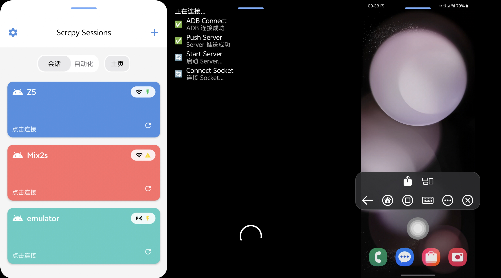
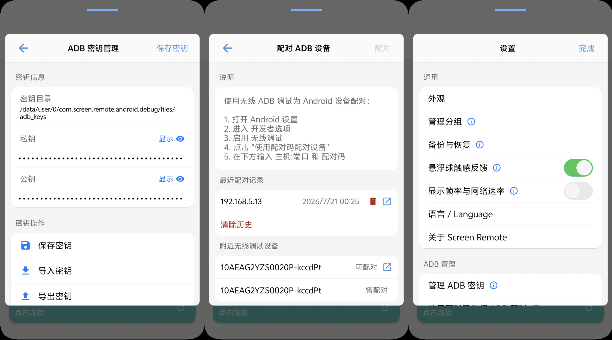
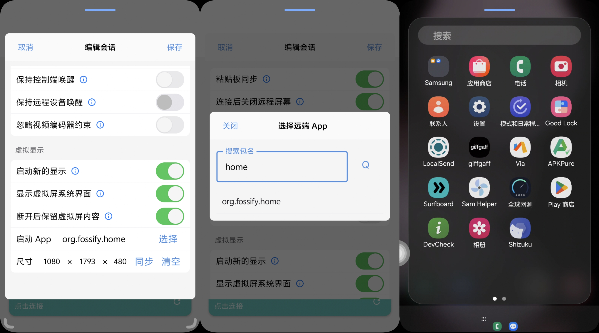
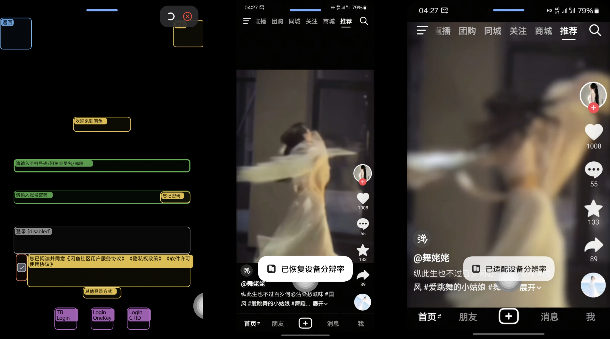
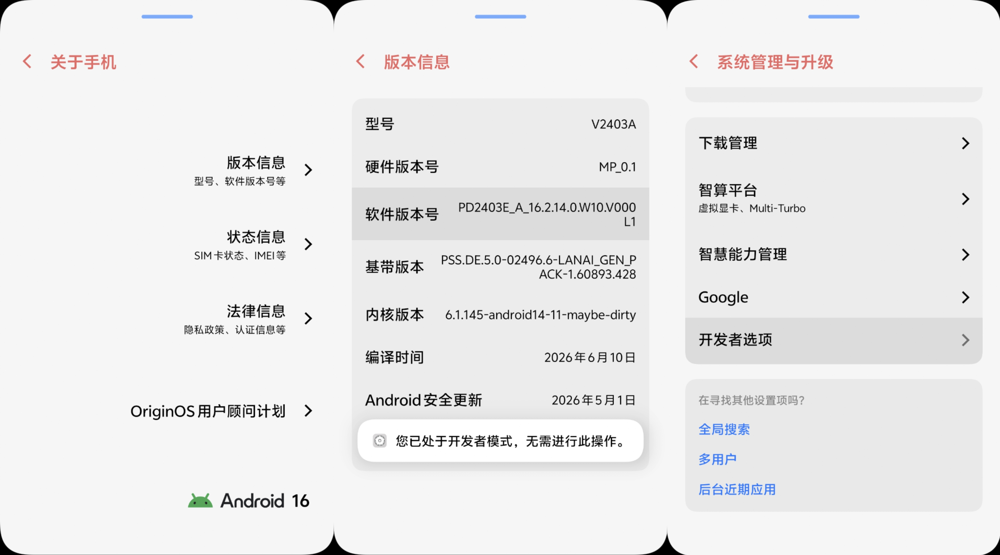
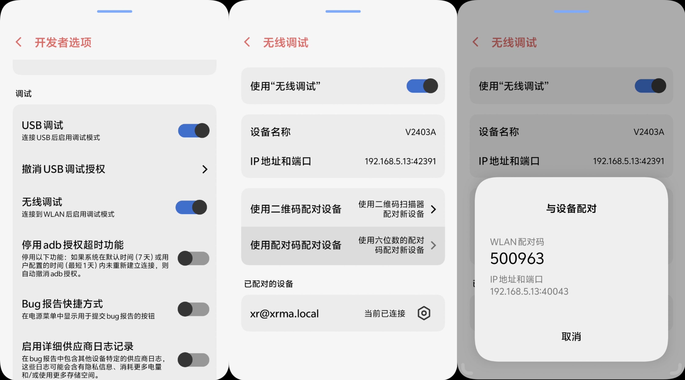
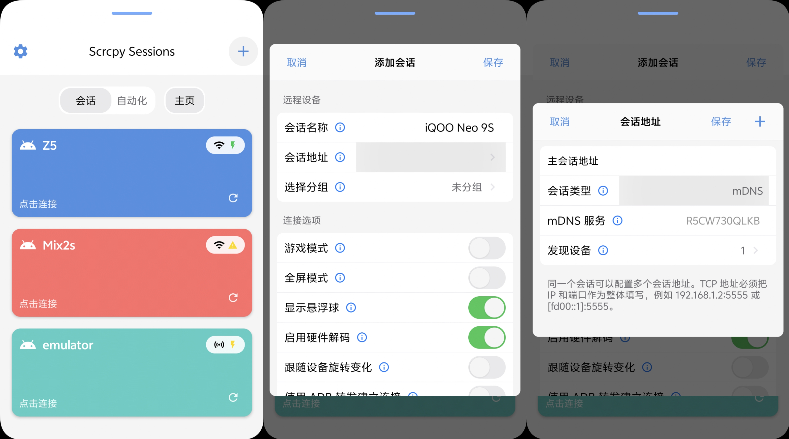

# Screen Remote

> [!IMPORTANT]
> [English](README.md) | [简体中文](README_CN.md) | [用户使用文档](https://github.com/XRSec/Screen-Remote/wiki/用户使用文档) | [开发文档](https://github.com/XRSec/Screen-Remote/wiki/开发文档) | [哔哩哔哩](https://b23.tv/BV1BAKg6kE7v) | [YouTube](https://youtu.be/2LU9DtDK3fs)

Screen Remote 是一个面向 Android 控制 Android 的远程控制与设备管理应用。

它基于 scrcpy 和 Android ADB 能力，在一台 Android 设备上完成另一台 Android
设备的连接、投屏、音视频传输、触控操作和日常管理，无需依赖电脑。应用支持 TCP、USB Host 与 Wireless
Debugging，可通过无线配对、mDNS 自动发现和多个备用地址快速连接设备；同时提供游戏模式、虚拟屏、端口转发、文件与应用管理、Shell
和实时诊断等能力，适合日常远控、低延迟游戏、设备维护及开发排障。

## 可以做什么

- 管理多台设备、会话分组和独立参数，为同一会话保存主地址与多个备用地址
- 通过 TCP、USB Host 或 Wireless Debugging 连接设备，并使用无线配对、mDNS 自动发现和地址延迟测试
- 实时查看远端画面与音频，发送多指触控、按键、文本和粘贴板内容，并跟随远端屏幕方向
- 开启游戏模式，针对高帧率视频、连续移动和短按操作优化触控与解码链路
- 创建独立虚拟屏，在不影响设备主屏的情况下启动指定 App 或桌面
- 配置目标设备端口转发，从控制端访问目标设备上的网络服务
- 查看设备信息，管理文件、应用和进程，执行 Shell 命令及常用系统操作
- 查看解码与渲染帧率、视频码率和网络吞吐，使用实时日志、编解码器检测和布局检查辅助排障
- 导出和恢复会话、分组、设置及 ADB 身份等关键配置

## 界面预览

以下截图来自当前版本的 Android 客户端。

### 屏幕控制

- 主页
- 连接过程
- 目标设备

### 设备管理

- 设备信息
- 实用工具
- 文件管理
- 应用管理
- 进程管理
- 端口转发
- 运行命令

### 软件设置

- 设置页面
- 外观 跟随系统/ 浅色 / 深色
- 语言 跟随系统 / 中文 / 英语
- 触感反馈
- 帧率显示
- 自定义 ADB 密钥
- 无线调试配对
- 调试模式
- 日志管理
- 关于 / 反馈

### 编解码器测试

### 虚拟屏幕

### UI 分析与分辨率调整

### 设备调试

- 自动跟随
- 实时信息
- 调试小窗

## 无线调试开启方法

### 开发者设置

### 软件使用方法

#### 配对 无线调试

#### 添加会话

#### 添加会话地址

## Star History

<a href="https://www.star-history.com/?repos=XRSec%2FScreen-Remote&type=date&legend=top-left">
 <picture>
   <source media="(prefers-color-scheme: dark)" srcset="https://api.star-history.com/chart?repos=XRSec/Screen-Remote&type=date&theme=dark&legend=top-left&sealed_token=LKnabYe1iTjH5Z-0o2cnSwnlQQ_JMsMvQ4c5V6pgEzHGoiSI7k-u2oCRSU3YMeYQnU86cssUZoGWJzbncchLa35UlpaQMdFQuGRzobudJkDC1AGCdgQc_Q" />
   <source media="(prefers-color-scheme: light)" srcset="https://api.star-history.com/chart?repos=XRSec/Screen-Remote&type=date&legend=top-left&sealed_token=LKnabYe1iTjH5Z-0o2cnSwnlQQ_JMsMvQ4c5V6pgEzHGoiSI7k-u2oCRSU3YMeYQnU86cssUZoGWJzbncchLa35UlpaQMdFQuGRzobudJkDC1AGCdgQc_Q" />
   
 </picture>
</a>
